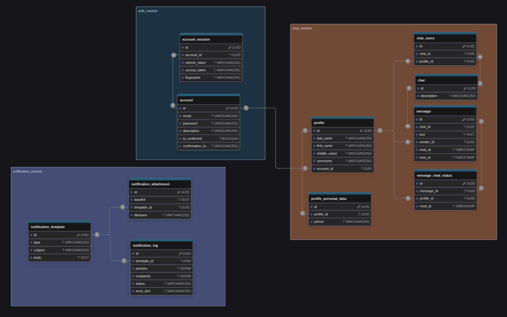

# Messenger Backend
Современный мессенджер на основе FastAPI с поддержкой WebSocket соединений, групповых чатов и real-time обмена сообщениями.

## Запуск и установка:

### localhost
1. Для первого запуска надо настроить переменные окружения
2. Установить зависимости из `requirements.txt`
3. Запустить основной исполняемый файл `./main.py`:
    1. `python3 main.py`
    2. http://localhost:8788/

### docker-compose
1. Установить переменные окружения: `cp .env.sample .env`
    1. Указаны все необходимые переменные для дефолтного старта
2. `docker compose up`
3. http://localhost:8788/

### Предустановленные пользователи
Если будет стоять переменная окружения `ENVIRONMENT=LOCAL`,
то БД заполнится фейковыми данными. В .env.sample она установлена по умолчанию

| login                | password |
| :------------------: | :------: |
| admin@admin.ru       | admin    |
| api-test@example.com | admin    |
| user1@example.com    | admin    |
| user2@example.com    | admin    |
| user3@example.com    | admin    |

### Запуск тестов
1. localhost:
    1. `virturalenv venv`
    2. `source venv/bin/activate`
    3. `pip install requirements-dev.txt`
    4. `pytest`
2. В контейнере:
    1. `docker compose exec messenger-api /run_tests.sh`

## Схема БД


## Структура проекта
```
.
├── Dockerfile
├── README.md
├── alembic.ini
├── app
│   ├── adapters                        - адаптеры для внешних запросов
│   │   ├── base                        - базовые клиенты
│   │   ├── clients                     - клиенты для подключения к внешним источникам
│   │   │   └── smtp.py
│   │   ├── db                          - адаптер Базы Данных
│   │   │   ├── migrations              - миграции базы данных
│   │   │   └── utils
│   │   │       ├── database_setup.py   - иницализация БД
│   │   │       └── file_search.py      - поиск файла alembic.ini
│   │   └── errors.py                   - ошибки модуля БД
│   ├── dependencies                    - dependency injection для FastAPI
│   │   ├── dependency_db.py            - получение сессии
│   │   └── services_dependency.py      - получение сервисов
│   ├── fastapi_engine
│   │   ├── app.py
│   │   ├── constructor.py
│   │   ├── events                      - события, для приложения
│   │   │   ├── error_event.py          - обрботка ошибок приложения
│   │   │   └── startup.py              - инициализация событий при старте приложения
│   │   └── middlewares                 - мидлвари для фастапи
│   │       ├── cors_middleware.py      - мидлварь CORS
│   │       ├── errors_middleware.py    - обработчик Exception, который не предусмотрели в базовой логике
│   │       ├── log_middleware.py       - логирование запроса/ответа
│   │       └── success_middleware.py   - оборачивает ответ от сервера в стандартную структуру
│   ├── modules
│   │   ├── base_module                 - базовый модуль, в нем хранятся наследуемые объекты
│   │   ├── auth_module                 - модуль авторизации
│   │   ├── catalogues_module           - модуль справочников
│   │   ├── chat_module                 - модуль чатов
│   │   ├── healthcheck_module          - healthcheck module
│   │   └── notify_module               - модуль уведомлений
│   ├── resources                       - хранение констант
│   │   └── constants.py
│   ├── services                        - базовые сервисные ошибки
│   │   └── errors.py
│   ├── settings                        - базовые настройки приложения
│   │   ├── base.py                     - базовые настройки
│   │   ├── app_settings.py             - настрофки FastAPI
│   │   ├── auth_settings.py            - настройки модуля авторизации
│   │   ├── chat_settings.py            - настройки модуля чатов
│   │   ├── db_settings.py              - настройки БД
│   │   ├── jwt_settings.py             - настройки JWT
│   │   ├── log.py                      - настройки логов
│   │   ├── modules_settings.py         - настройки подключаемых модулей
│   │   └── smtp_settings.py            - настройки почтового сервера
│   └── utils
│       ├── err_message.py              - текст ошибки, который присылается при обработке Exception в АПИ
│       ├── errors_map.py               - коды ошибок
│       ├── extract_data_from_db_err.py - получение текста ошибки из sqlalchemy
│       ├── fake_client.py              - фекер, для наполнения тестовыми данными БД
│       ├── module_creator              - создание новых модулей
│       │   ├── base_creator.py         - базовый функционал
│       │   ├── creator.py              - основной исполняемый класс
│       │   └── __init__.py             - содержит функцию для создания модулей
│       └── setup_modules.py            - установка модулей определяемых переменными окружения
├── manage.py                           - многофункциональный скрипт
├── docker-compose.yml
├── entrypoint.sh                       - инициализация и запуск бекенда
├── logs                                - папка для хранения логов приложения
├── main.py                             - основной запускаемый файл
├── pyproject.toml                      - настройки проекта
├── requirements-dev.txt                - зависимости проекта включая пакеты для тестирования
├── requirements.txt                    - зависимости проекта
└── tests                               - базовый тестовый модуль
    ├── conftest.py                     - импорт фикстур для использования pytest
    ├── fakers.py                       - фейковые клиенты, имитирующие поведение клиентов
    └── fixtures.py                     - базоыве фикстуры
```
## Архитектурные принципы

- Разделение по слоям: Контроллеры -> Сервисы -> CRUD -> Модели
- Dependency Injection: Чистая архитектура без жестких связей
- Модульность: Каждый модуль независим и может быть отключен
- Асинхронность: Полная поддержка async/await
- Типизация: Строгая типизация с Pydantic

## Модули:
### Auth Module
Управление пользователями, аутентификация и авторизация

- JWT токены (access/refresh)
- Подтверждение email
- Восстановление пароля
- Сессии пользователей

### Chat Module
Основной функционал мессенджера

- WebSocket соединения
- Групповые чаты
- Отправка сообщений
- Статусы прочтения
- История сообщений
- Предотвращение дублирования

### Base Module
Базовые компоненты для других модулей

- Базовые CRUD операции
- Схемы данных
- Обработка ошибок
- Пагинация

### Notify Module
Система уведомлений

- Email уведомления
- Шаблоны писем
- Логирование отправок

## API Документация
После запуска приложения документация API доступна по адресам:

- Swagger UI: http://localhost:8788/

## Основные эндпоинты
### Авторизация
- `POST /accounts/sign-up/` - Регистрация
- `POST /accounts/sign-in/` - Вход
- `POST /accounts/sign-out/` - Выход
- `GET /accounts/me/` - Информация о пользователе

### Чаты

- `GET /chats/` - Список чатов пользователя
- `POST /chats/` - Создание чата
- `PUT /chats/{chat_id}` - Изменение чата
- `GET /chats/{chat_id}/` - Информация о чате
- `GET /chats/{chat_id}/history/` - История сообщений
- `GET /chats/ui` - Интерфейс теста чатов

### WebSocket
- `WS /chats/{chat_id}/ws` - WebSocket соединение для чата

### WebSocket API
Подключение к чату

- Подключитесь к `ws://localhost:8788/chats/{chat_id}/ws`
Отправьте сообщение авторизации:
```json
{
  "type": "auth",
  "token": "your_jwt_token"
}
```

#### Типы сообщений
- Отправка сообщения
```json
{
  "type": "send_message",
  "text": "Текст сообщения"
}
```
- Отметка о прочтении
```json
{
  "type": "mark_read",
  "last_read_message_id": "uuid"
}
```
- Индикатор печати
```json
{
  "type": "typing",
  "is_typing": true
}
```
